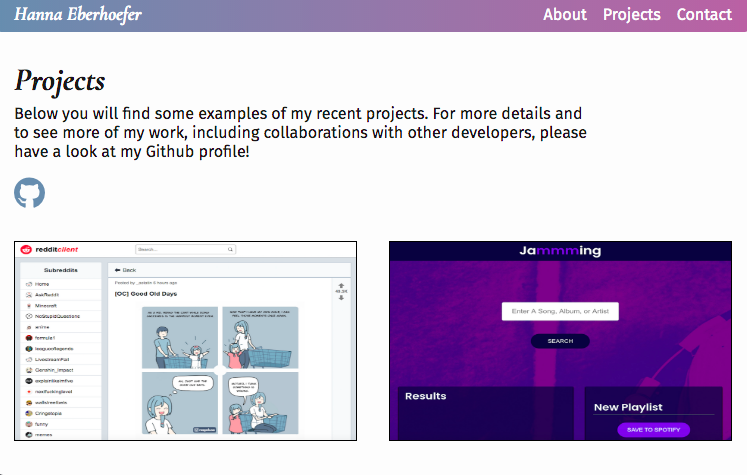

# Reddit Client

## About

A personal portfolio site built with HTML, CSS, and Javascript.

## Motivation

This project is part of the [Codecademy Front-End Engineer](https://www.codecademy.com/learn/paths/front-end-engineer-career-path) career path.

## Installation Instructions

In your terminal, run `git clone https://github.com/HannaEb/portfolio`. The application can then be viewed by opening the index.html file in the browser.

## Author

HannaEb
